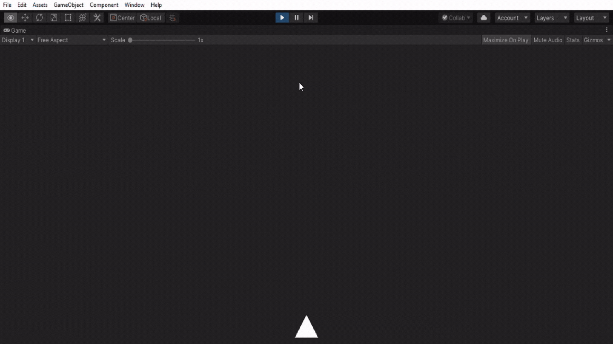
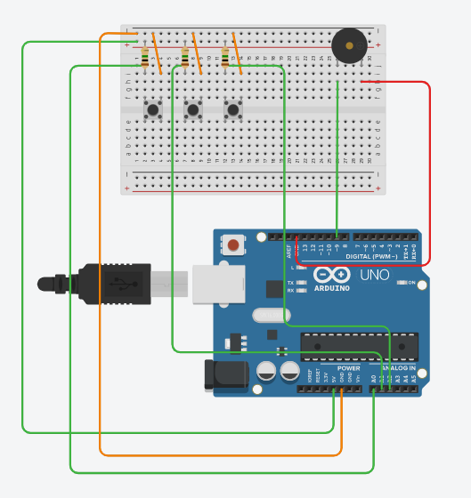

# Arduino-2D
 Arduino project to control Unity game with Arduino.
 </img>
 Steps to Play: 
 1. Clone this Project, type the following code in Terminal  
 <code>git clone https://github.com/KrishBaidya/Arduino-2D.git</code> 
 2. Connect all the wires in Arduino. 
 
 3. Upload the Arduino.ino file in Assets\Scripts\Arduino\Arduino.ino
 4. Open the Unity Editor and Click "Play"